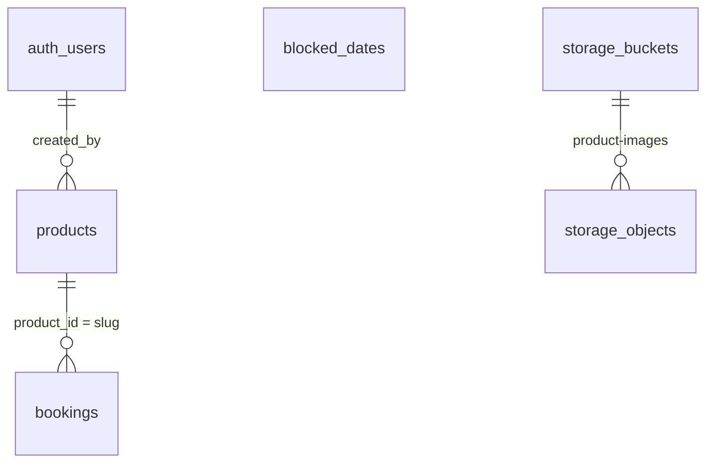

# Kodbasanalys — Forshälla Alltjänst (Phase 1 MVP)

Expertarkitekt-sammanfattning av implementerat läge i bokningssystemet/CMS.

**Genererad:** 2026-05-30

---

## 1. Tech-stack & beroenden

| Lager | Val |
|--------|-----|
| **Monorepo** | `pnpm` workspaces + **Turborepo** (`turbo.json`), Node ≥20 |
| **Appar** | `apps/web` (kund, port 3000), `apps/admin` (CMS, port 3001) |
| **Ramverk** | **Next.js 15** App Router, **React 19** |
| **Databas** | **Supabase** (PostgreSQL + Auth + Storage) via `@supabase/supabase-js`; admin även `@supabase/ssr` för cookies |
| **ORM** | Ingen — PostgREST-queries direkt |
| **UI** | **Tailwind CSS 3.4**; **lucide-react** (admin); inga Shadcn/Radix/MUI |
| **State** | React `useState`/`useMemo` + **localStorage** (admin inställningar/kalender); inget Zustand/Redux |
| **Delat paket** | `@booking-system/config` (TS/ESLint), `@booking-system/ui` (**tom stub**, `export {}`) |

**Web-deps:** `next`, `react`, `@supabase/supabase-js` (server, service role).

**Admin-deps:** samma + `@supabase/ssr`, `lucide-react`.

**Saknas medvetet (Phase 1):** BankID, betalning, SMS, Prisma/Drizzle, genererade Supabase-typer (CLI).

---

## 2. Databas & entiteter

**Källa:** `supabase/schema.sql` + migrationer `20260329120000_bookings_and_blocked_dates.sql`, `20260514120000_products_pricing_and_rls.sql`, `20260515140000_storage_product_images.sql`, `seed.sql`.



### Tabeller

| Tabell | PK | Viktiga fält | Relationer |
|--------|-----|--------------|------------|
| **`products`** | `slug` (TEXT) | `name`, `price_per_day/week/month`, `description`, `category` ∈ {`entreprenad`,`event`}, `image`, `agreement`, `info`, `requires_delivery`, `is_active`, `created_by`, tidsstämplar | `created_by` → `auth.users(id)` |
| **`bookings`** | `id` (UUID) | `product_id`, kund (`name/email/phone`), `start_date`, `end_date`, `total_price`, `status` ∈ {`pending`,`confirmed`} | `product_id` → `products.slug` ON DELETE RESTRICT |
| **`blocked_dates`** | `id` (UUID) | `date` (UNIQUE), `reason` | Global lista (inte per-admin i DB) |
| **`auth.users`** | Supabase Auth | — | Används implicit via JWT `authenticated` |

**Storage:** bucket `product-images` (public read; authenticated insert/update/delete).

### RLS (sammanfattning)

- **`products`:** `anon` SELECT (alla rader); `authenticated` INSERT (`created_by = auth.uid()`), UPDATE/DELETE; `service_role` ALL (för web-API med service key).
- **`bookings`:** endast `authenticated` CRUD; **ingen `anon`-policy** (kundflöde skriver inte till DB ännu).
- **`blocked_dates`:** `authenticated` CRUD + **`anon` SELECT** (avsedd för kundkalender).

**Gap:** `bookings` används inte i app-kod ännu. `blocked_dates` drivs via Supabase (admin direkt, kund via GET `/api/blocked-dates`).

---

## 3. Routing & arkitektur

### Monorepo-layout

```
BookingSystem/
├── apps/web/          # Kundportal + BFF-API
├── apps/admin/        # CMS (route group (admin))
├── packages/ui/       # Oanvänt
├── packages/config/
└── supabase/          # schema, migrations, seed
```

### Kund (`apps/web`)

| Typ | Route | Implementation |
|-----|--------|----------------|
| Page | `/` | Landning: Maskiner / Bastu |
| Page | `/maskiner` | SSR produkter `category=entreprenad` |
| Page | `/bastu` | SSR `category=event` |
| Page | `/kassa?slug=` | Checkout UI (mock BankID, ingen DB-persistens) |
| API | `GET/PUT /api/products` | Supabase (`service_role`) eller fallback `data/products.json` |
| API | `GET /api/blocked-dates` | Supabase `blocked_dates` (service role) |
| API | `GET/PUT /api/personal-events` | **Filesystem** `data/personal-events.json` |

**Ingen `middleware.ts` på web** — publikt.

**Dataflöde produkter (web):** Server Components → `lib/products-data.ts` → Supabase (aktiva) eller `products.json`. Parallellt REST-API för admin/legacy (CORS GET/PUT).

### Admin (`apps/admin`)

| Typ | Route | Status |
|-----|--------|--------|
| Auth | `/login` | Supabase `signInWithPassword` |
| Page | `/` | Översikt — **mock-bokningar** |
| Page | `/bookings` | **mock** lista/modaler |
| Page | `/calendar` | Blockering via **Supabase** (browser JWT); personliga händelser via web-API |
| Page | `/inventory` | **Produktion:** CRUD mot Supabase + bilduppladdning |
| Page | `/settings` | Avtal/användare — **localStorage/mock** |
| Redirect | `/avtal` → `/settings` | |
| Redirect | `/logistics` → `/` | |

**Route group:** `app/(admin)/layout.tsx` — server-side `auth.getUser()`, sidebar + header.

**Admin → web:** `NEXT_PUBLIC_WEB_APP_URL` för `personal-events` (JSON). Blockerade datum: Supabase direkt från admin.

---

## 4. Autentisering & säkerhet

### Admin

- **Supabase Auth** (e-post/lösenord), session via **HTTP cookies** (`@supabase/ssr`).
- **`middleware.ts`:** refresh session; oinloggad → `/login`; inloggad på `/login` → `/`.
- **`(admin)/layout.tsx`:** andra kontroll med `getSupabaseServerClient().auth.getUser()`.
- **Utloggning:** `signOut` i `AdminHeader`.

### RBAC

- **Ingen rolltabell, inga custom claims, inga admin-specifika policies.**
- Skydd = “har giltig Supabase JWT” → PostgREST-roll **`authenticated`** får full CRUD på `products`/`bookings`/`blocked_dates` enligt migrationer.
- **Implikation:** alla registrerade Auth-användare i projektet är i praktiken CMS-admins.

### Kund & API

| Yta | Auth |
|-----|------|
| Web-sidor | Öppen |
| `/api/products` PUT | **Ingen route-auth**; bypassar RLS via **`SUPABASE_SERVICE_ROLE_KEY`** om satt |
| `/api/blocked-dates` | GET, service role; skriv sker i admin via JWT |
| `/api/personal-events` | **Ingen auth**; JSON på disk |
| Kassa | Ingen kundauth; mock BankID |

**Positivt:** explicita kolumnlistor, RLS på DB, `created_by`-check vid product INSERT.

**Risker:** service role på web GET; `personal-events` fil-API utan auth.

---

## 5. UI & komponenter

### Designsystem

- **Tailwind** överallt; **ingen Shadcn**.
- **Web:** egna paletter (t.ex. Pro Power `#CC0000` på maskiner; teal på bastu); Google Fonts via layout (`playfair`, `montserrat`, `arvo`, `inter`).
- **Admin:** CSS-variabler i `globals.css` (`--admin-*`) + utility-klasser: `.admin-card`, `.admin-btn-primary`, `.admin-table-th`, m.m.

### Web (`apps/web/components/`)

| Komponent | Roll |
|-----------|------|
| `layout-client`, `header`, `footer` | Shell/nav |
| `booking-calculator` | Datum/pris, helgblock, blocked-dates-fetch, rabatt ≥3 dagar |
| `machine-card`, `landing-product-card` | Produktkort |
| `address-autocomplete` | Leveransadress (kassa) |
| `contact-form` | Kontakt |

### Admin (`apps/admin/app/components/` + sidor)

| Komponent | Roll |
|-----------|------|
| `AdminShell` | Mobilmeny-context |
| `AdminSidebar` | Nav: Översikt, Bokningar, Kalender, Hyrobjekt, Inställningar |
| `AdminHeader` | E-post + logout |
| `ProductForm` | CRUD-formulär hyrobjekt |
| Sidor | Översikt/Bokningar/Kalender/Settings = **klient-UI med mock/localStorage**; **Inventory = Supabase** |

**Ikoner:** lucide-react (admin only).

---

## Implementeringsmatris

| Domän | Postgres + RLS | App-kod |
|--------|----------------|---------|
| Produkter (läs kund) | Ja | Ja (SSR/API + JSON-fallback) |
| Produkter (admin CRUD) | Ja | **Ja** (`/inventory`) |
| Produktbilder | Storage bucket | **Ja** (`product-storage.ts`) |
| Bokningar | Tabell finns | **Nej** — mock i admin, kassa sparar inte |
| Blockerade dagar | Ja | **Ja** (admin Supabase CRUD, kund GET API) |
| Personliga kalenderhändelser | — | **JSON-API** |
| Avtal/BankID/betalning | — | UI/mock (Phase 1 exkluderat) |

---

## Slutsats

Stacken är en **Turborepo + dual Next.js + Supabase**-MVP där **produktkatalog och blockerade datum** är kopplade till databasen. Bokningar och personliga kalenderhändelser lever i **mock/JSON** trots att `bookings` migrerats. Auth är **binär inloggning** utan roller; web-API med service role och fil-endpoints behöver hårdare gränsskydd innan produktion. `@booking-system/ui` är outnyttjad.
